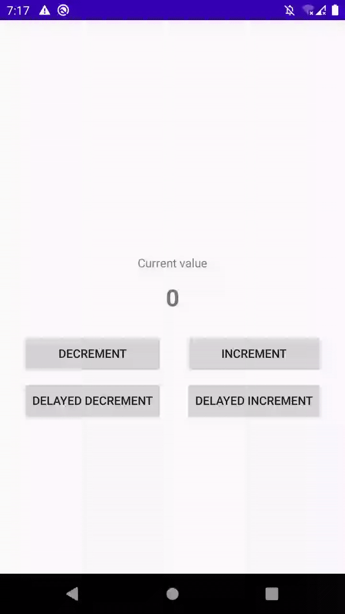
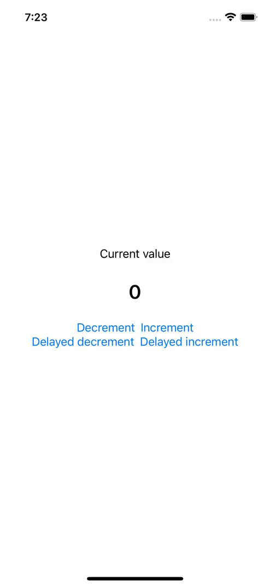

# Shared Counter

This is an example of how you can create a common ViewModel to share as much code as possible between platforms.

In this example, we are using the approach presented in the KaMPKit, introduced in the [PR 238](https://github.com/touchlab/KaMPKit/pull/238). This approach leverages the expect/actual feature from KMP to implement the base ViewModel class, providing the minimum requirements for an implementation.

On Android it delegates the implemetation to the AndroidX ViewModel. On iOS we have to implement the ViewModel and handle its lifecycle manually.

We also have a Wrapper class on iOS to handle coroutines and flow. We decided to call it `CallbackViewModel` as all async calls from coroutines are converted to callbacks. It is responsible for hiding the suspend operator and creating flow adapters for a smooth integration on iOS.

| Android | iOS |
| --- | --- |
|  |  |

## Classes Summary

Base Classes:

* [Expected ViewModel](shared/src/commonMain/kotlin/dev/valvassori/shared/counter/vm/ViewModel.kt) - Expect definition in the common code for a ViewModel implementation;
* [Actual Android ViewModel](shared/src/androidMain/kotlin/dev/valvassori/shared/counter/vm/ViewModel.kt) - Actual implementation of the common class using the AndroidX ViewModel as base class;
* [Actual iOS ViewModel](shared/src/iosMain/kotlin/dev/valvassori/shared/counter/vm/ViewModel.kt) - iOS implementation of the common class;
* [CallbackViewModel](shared/src/iosMain/kotlin/dev/valvassori/shared/counter/vm/ViewModel.kt) - iOS wrapper for ViewModels;
* [FlowAdapter](shared/src/iosMain/kotlin/dev/valvassori/shared/counter/flow/FlowAdapter.kt) - iOS wrapper for Flows;

Implementations:

* [CounterViewModel](shared/src/commonMain/kotlin/dev/valvassori/shared/counter/vm/CounterViewModel.kt) - Common ViewModel that is shared between Android and iOS;
* [CounterCallbackViewModel](shared/src/iosMain/kotlin/dev/valvassori/shared/counter/vm/CounterCallbackViewModel.kt) - iOS ViewModel wrapper;
* [MainActivity](androidApp/src/main/java/dev/valvassori/shared/counter/android/MainActivity.kt) - Usage example on Android;
* [CounterModel](iosApp/iosApp/CounterView.swift) - Usage example on iOS;